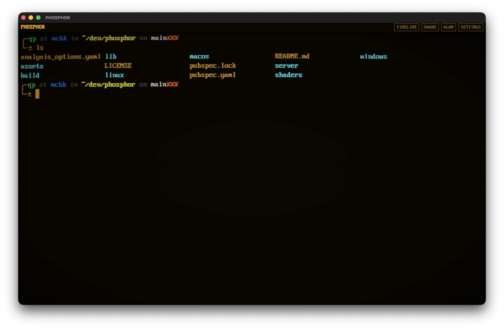
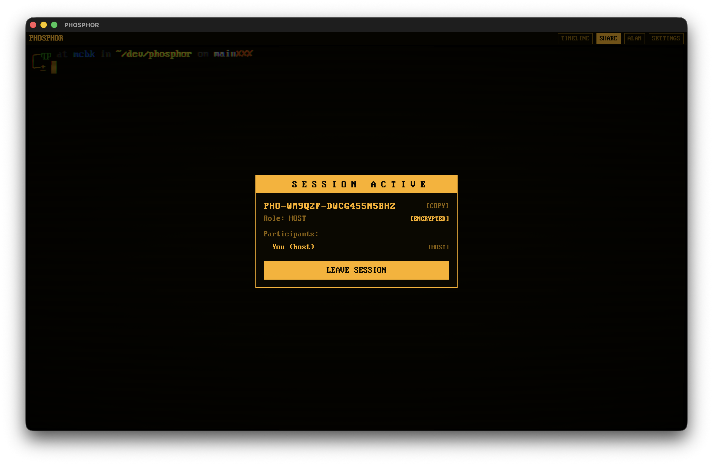
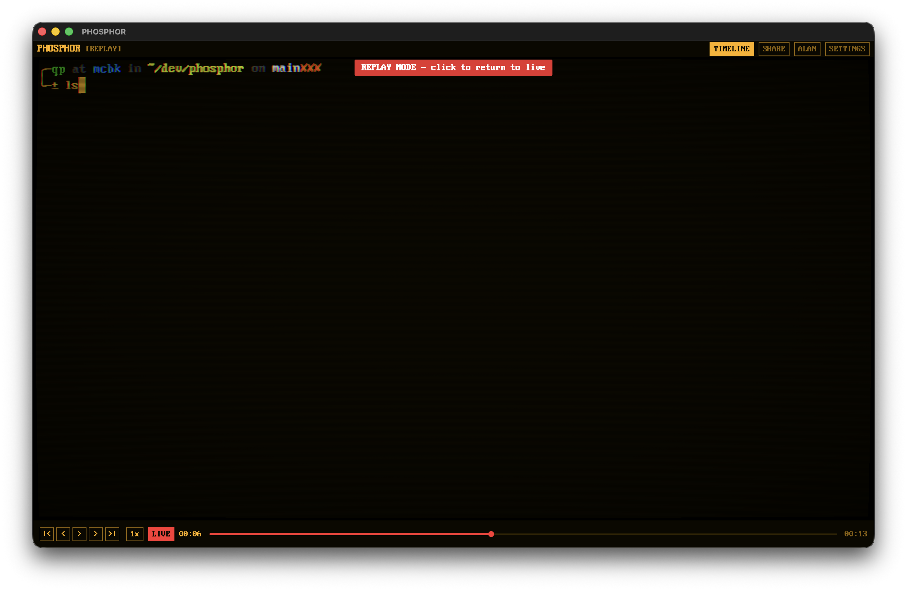
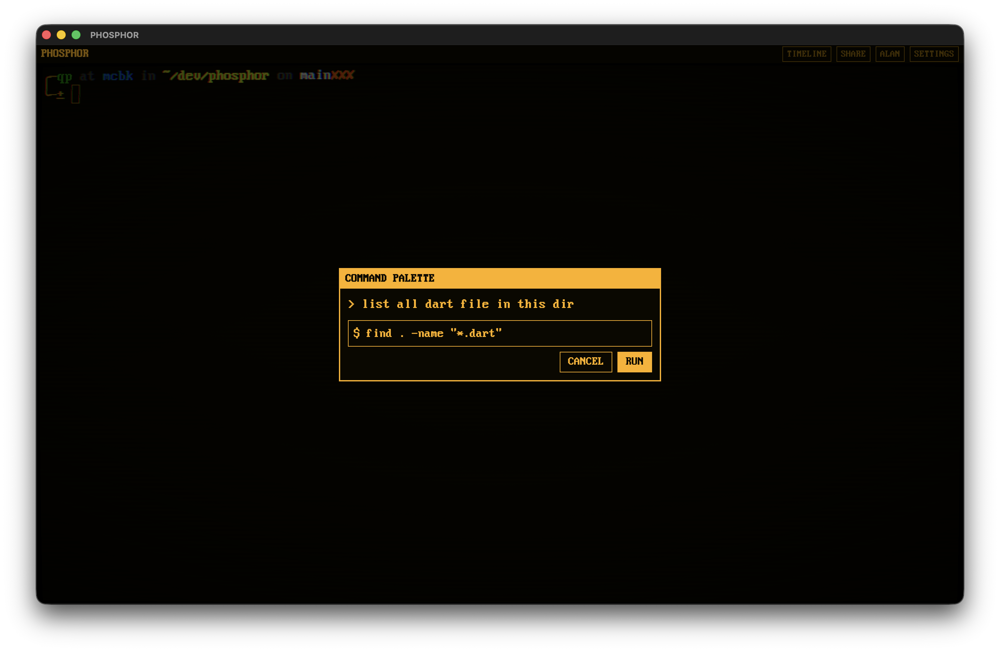
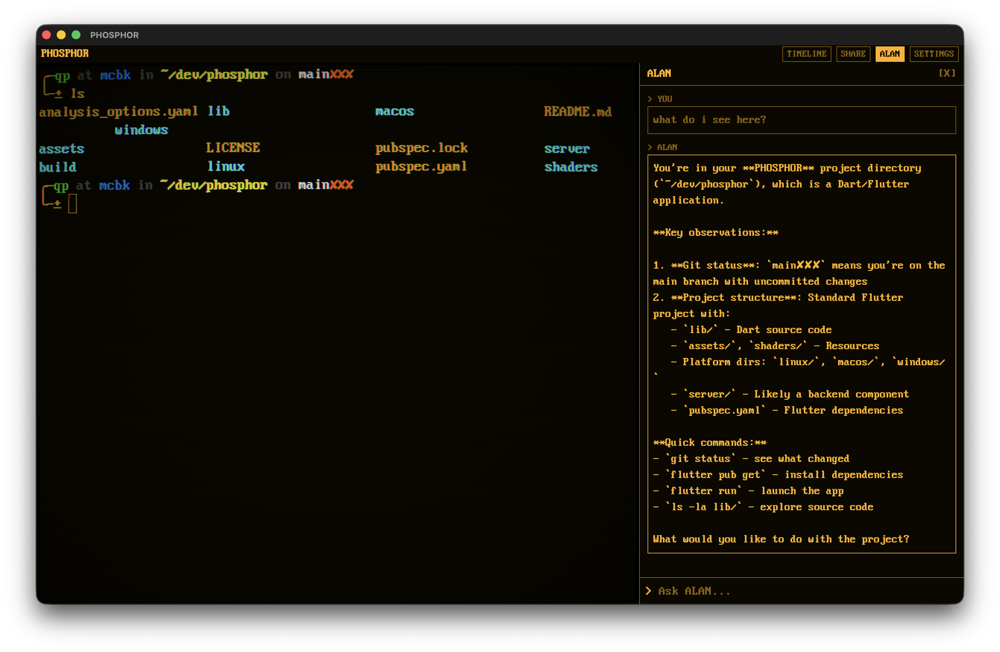

<p align="center">
  
</p>

<h1 align="center">PHOSPHOR</h1>

<p align="center">
  <strong>The terminal, rethought.</strong><br>
  Share your session with a code. Rewind anything. Ask in plain English when you're stuck.<br>
  Cross-platform. Open source. Works fully offline.
</p>

<p align="center">
  <a href="#share-your-terminal">Share</a> &middot;
  <a href="#rewind-everything">Rewind</a> &middot;
  <a href="#just-ask">Just Ask</a> &middot;
  <a href="#the-look">The Look</a> &middot;
  <a href="#install">Install</a> &middot;
  <a href="#run-your-own-relay">Self-Host</a>
</p>

---

The command line is the most powerful interface on your computer. It's also the most hostile to learn. You can't rewind what just happened. You can't show someone what you're seeing. And when something breaks, you're copy-pasting errors into a search engine.

PHOSPHOR fixes that. It's a real terminal — your shell, your tools, your workflows — with three things the CLI never had: **sharing**, **recording**, and **natural language**.

Runs on **macOS** and **Linux**.

---

## Share Your Terminal

<p align="center">
  
</p>

Click **SHARE**. Click **HOST**. Send the code to whoever needs to see your terminal. They paste it and they're in — watching your session live.

That's it. No screen sharing apps, no "can you see my screen?", no port forwarding. One code.

The host controls everything. Promote someone to **Editor** and they can type into your terminal. Keep them as **Viewer** and they watch. Kick anyone at any time.

**Built for:**
- Teaching someone the command line — they see exactly what you do, in real-time
- Pair programming — two people, one shell
- Debugging together — "look at this" takes 5 seconds
- Team ops — run a relay on your LAN and share sessions across your office

**End-to-end encrypted.** The relay server is a dumb pipe — it routes opaque ciphertext and never sees your data. The encryption key is baked into the session code and never leaves the clients. TLS-only with certificate pinning. Up to 10 participants.

---

## Rewind Everything

<p align="center">
  
</p>

Every session is recorded automatically. Every keystroke, every byte of output, timestamped.

Press `Cmd+T` to open the timeline. Scrub to any point. Step through events one by one. Auto-play at up to 16x speed. Your live session keeps running in the background — you're watching a replay.

Ran a command 20 minutes ago and need the output? Rewind. Want to show a junior dev what happened step by step? Play it back.

---

## Just Ask

<p align="center">
  
</p>

Press `Cmd+K` and describe what you need:

> "find all go files modified in the last week"

PHOSPHOR generates the command. You see it before it runs. Hit enter to execute, escape to cancel.

It's not a generic chatbot — it knows your shell, your OS, your installed tools, your working directory, and what you've been doing. The suggestions are specific to your environment.

For longer conversations, open the side panel with `Cmd+Shift+K` — explain errors, generate scripts, ask questions.

PHOSPHOR also watches your output. When a command fails, it catches the error and offers a one-click explanation.

<p align="center">
  
</p>

**Works with whatever you prefer:**

| Provider | What you need |
|---|---|
| **Ollama** | Nothing. Install Ollama, run it. Fully local, fully private, no account. |
| **Anthropic** | `ANTHROPIC_API_KEY` in your shell profile |
| **OpenAI** | `OPENAI_API_KEY` in your shell profile |

Model lists are fetched live from each provider. Switch any time in settings.

---

## The Look

PHOSPHOR renders through a real-time GLSL shader on the GPU — scanlines, phosphor bloom, barrel distortion, chromatic aberration, flicker. One slider from clean modern terminal (0%) to full CRT (100%). Three phosphor palettes: Green, Amber, White.

Audio to match: IBM Model M keystrokes on every keypress, CRT power-on, ambient hum. Each sound individually toggleable.

**Don't want it?** Set intensity to zero. PHOSPHOR is still everything above without the aesthetics.

---

## Install

### Prebuilt releases (recommended)

Download the latest release from the [Releases page](https://github.com/nesdeq/phosphor/releases).

**macOS (Apple Silicon):**

1. Download `phosphor-macos-arm64.zip`
2. Unzip and drag `Phosphor.app` to Applications
3. Remove the quarantine attribute (required for unsigned apps):
   ```bash
   xattr -dr com.apple.quarantine /Applications/Phosphor.app
   ```

**Linux (x86_64):**

1. Download `phosphor-linux-x86_64.tar.gz`
2. Extract and run the installer:
   ```bash
   tar xzf phosphor-linux-x86_64.tar.gz
   ./install.sh
   ```
   This installs to `~/.local/share/phosphor/`, adds `phosphor` to your PATH via `~/.local/bin/`, and creates a desktop entry.

### Build from source

```bash
git clone https://github.com/nesdeq/phosphor.git
cd phosphor
flutter pub get
flutter run -d macos    # or linux
```

Needs Flutter 3.27+ and your platform's toolchain (Xcode on macOS, GTK3 on Linux).

### AI setup

For the natural language features, either run [Ollama](https://ollama.com) locally or set an API key in your shell profile (`.zshrc`, `.bashrc`, `.profile`, etc.):

```bash
export ANTHROPIC_API_KEY="sk-ant-..."
# or
export OPENAI_API_KEY="sk-..."
```

PHOSPHOR reads your shell environment on launch — no need to configure keys inside the app.

---

## Run Your Own Relay

Multiplayer requires a relay server. There are two roles: the person who **runs the server**, and the people who **connect to it** (clients).

### Server operator

You generate the TLS certificates, deploy the server, and distribute `public.pem` to your clients.

```bash
# 1. Generate certs and package the server
./server_setup.sh YOUR_SERVER_IP

# 2. Deploy to your server
scp phosphor-relay.zip user@YOUR_SERVER_IP:~/
ssh user@YOUR_SERVER_IP 'unzip phosphor-relay.zip && cd phosphor-relay && ./server.sh'

# 3. Send public.pem to every client
#    This file is safe to share — it's the public certificate, not the private key.
#    You'll find it in the repo root after running server_setup.sh.
```

The setup script generates two files: `private.pem` (stays on the server, never share) and `public.pem` (send to clients). It also packages `phosphor-relay.zip` with everything the server needs. The server only needs Dart installed, no Flutter.

### Clients

You need two things from the server operator: the **server address** and the **`public.pem`** file.

1. Save the `public.pem` file you received somewhere on your machine (e.g. `~/.phosphor/public.pem`)
2. Open PHOSPHOR → **Settings** (`Cmd+,` / `Ctrl+,`)
3. Under **MULTIPLAYER**, fill in:

| Setting | What to enter |
|---|---|
| **Relay Server** | The server address, e.g. `wss://192.168.1.50:8766` |
| **Server Cert** | The path where you saved `public.pem`, e.g. `~/.phosphor/public.pem` |

That's it. No rebuilding the app — just paste the address and point to the cert file.

PHOSPHOR uses the certificate to verify it's talking to the right server (certificate pinning). The server itself never sees your data — all session content is end-to-end encrypted.

---

## Shortcuts

| | macOS | Linux |
|---|---|---|
| Command palette | `Cmd+K` | `Ctrl+K` |
| AI panel | `Cmd+Shift+K` | `Ctrl+Shift+K` |
| Timeline | `Cmd+T` | `Ctrl+T` |
| Fullscreen | `Cmd+F` | `Ctrl+F` |
| Settings | `Cmd+,` | `Ctrl+,` |
| Close overlay | `Esc` | `Esc` |

---

## License

GPL-2.0 — see [LICENSE](LICENSE).

Audio: [bucklespring](https://github.com/zevv/bucklespring) (GPL-2.0), [freesound.org](https://freesound.org) (CC-BY 4.0, CC0).
